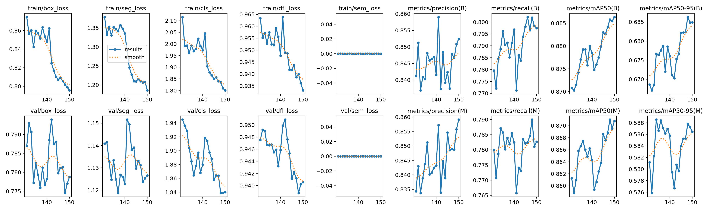
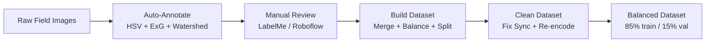
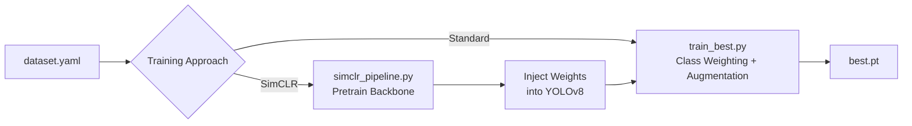
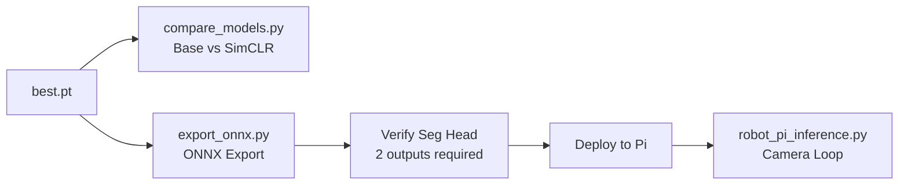

# 🌿 WeedPlucker-YOLOv8 — Intelligent Weed Detection & Robotic Plucking System

<p align="center">
  
</p>

> **A complete pipeline for training, evaluating, and deploying YOLOv8-segmentation models for precision weed detection in cauliflower fields — optimized for Raspberry Pi robotic deployment.**

---

## 📋 Table of Contents

- [Overview](#-overview)
- [Key Features](#-key-features)
- [Project Structure](#-project-structure)
- [Models & Results](#-models--results)
- [Quick Start](#-quick-start)
- [Pipeline Stages](#-pipeline-stages)
- [Model Comparison](#-model-comparison)
- [Deployment](#-deployment)
- [Dataset](#-dataset)
- [Open Source Availability](#-open-source-availability)
- [Citation](#-citation)
- [License][def]

---

## 🎯 Overview

WeedPlucker-YOLOv8 is a precision agriculture system that:

1. **Detects and segments** cauliflower crops (class 0) and weeds (class 1) using YOLOv8n-seg instance segmentation
2. **Outputs robot-ready coordinates** (pixel centroids + normalized coordinates) for autonomous weed plucking
3. **Deploys on edge devices** (Raspberry Pi 4/5) via ONNX/NCNN export with INT8 quantization
4. **Achieves state-of-the-art results** with two training approaches:
   - **Base model** — Standard YOLOv8n-seg with augmentation and class weighting
   - **SimCLR-pretrained model** — Self-supervised backbone pretraining on unlabelled field images, then fine-tuning

### Architecture

```
Camera → YOLOv8n-seg → Instance Masks + BBoxes → Centroid Extraction → Robot Controller
                              ↓
                    [crop mask] [weed mask]
                              ↓
                    Filter false positives
                              ↓
                    JSON: {action: PLUCK, x, y, z}
```

---

## ✨ Key Features

| Feature | Description |
|---------|-------------|
| **Dual-class segmentation** | Segments both cauliflower (crop) and weed instances |
| **SimCLR self-supervised pretraining** | Backbone pretrained on unlabelled field images via contrastive learning |
| **Class imbalance handling** | Dynamic class weighting + `copy_paste` augmentation for weed minority |
| **Edge deployment** | ONNX + NCNN export, optimized for Raspberry Pi 4/5 ARM inference |
| **Robot-ready output** | JSON with pixel coordinates, normalized coordinates, and action commands |
| **Full comparison toolkit** | Side-by-side visual + metric comparison between base and SimCLR models |

---

## 📁 Project Structure

```
WeedPlucker-YOLOv8/
├── README.md                                # This file
├── requirements.txt                         # Python dependencies
├── configs/
│   └── dataset.yaml                         # YOLO dataset configuration (2 classes)
│
├── scripts/
│   ├── data_preparation/                    # Dataset building & annotation
│   │   ├── step1_auto_annotate.py           # Auto-annotate cauliflower via HSV
│   │   ├── annotate_cauliflower.py          # ExG + HSV + Watershed annotation (v3)
│   │   ├── annotate_weeds.py                # Weed annotation pipeline
│   │   ├── build_dataset.py                 # Merge + balance + split dataset
│   │   ├── create_seg_labels.py             # Convert bbox labels → segmentation polygons
│   │   ├── fix_corrupted_images.py          # Fix dataset sync & re-encode JPEGs
│   │   ├── remove_empty_files.py            # Remove empty label files
│   │   └── weed_labels_checking.py          # Quick label count checker
│   │
│   ├── training/
│   │   ├── train_best.py                    # Main training script (class weighting, augmentation)
│   │   └── simclr_pipeline.py               # SimCLR self-supervised pretraining + reintegration
│   │
│   ├── inference/
│   │   ├── detect.py                        # Full inference with robot coordinates (YOLOv8)
│   │   ├── detect_onnx.py                   # Pure ONNX Runtime inference (no ultralytics)
│   │   └── robot_pi_inference.py            # Raspberry Pi camera-loop inference
│   │
│   ├── evaluation/
│   │   ├── compare_models.py                # Side-by-side Base vs SimCLR comparison
│   │   └── test_hybrid_exg.py               # Hybrid YOLOv8 + ExG vegetation index test
│   │
│   ├── export/
│   │   ├── export_onnx.py                   # Export YOLOv8-seg → ONNX (Pi-optimized)
│   │   └── export_ncnn_pi.py                # Export → NCNN for Pi 4
│
├── Training_results/
│   ├── base_model/                          # YOLOv8n-seg base model results
│   │   ├── args.yaml                        # Training configuration
│   │   ├── results.csv                      # Per-epoch metrics
│   │   ├── results.png                      # Training curves
│   │   ├── training_results.txt             # Final evaluation summary
│   │   ├── confusion_matrix.png             # Confusion matrix
│   │   ├── confusion_matrix_normalized.png
│   │   ├── labels.jpg                       # Label distribution
│   │   ├── Box*.png                         # Box P/R/F1/PR curves
│   │   ├── Mask*.png                        # Mask P/R/F1/PR curves
│   │   └── val_batch*                       # Validation predictions vs labels
│   │
│   ├── simclr_pretrained_model/             # SimCLR + fine-tuned model results
│   │   ├── args.yaml
│   │   ├── results.csv
│   │   ├── results.png
│   │   ├── confusion_matrix.png
│   │   ├── pretrain_log.txt                 # SimCLR pretraining log
│   │   └── retrain_log.txt                  # Fine-tuning log
│
├── test_images/                             # Raw image files used for testing and evaluation
├── tests/                                   # Legacy test scripts and earlier model iterations
└── weights/                                 # Saved YOLO model weights (.pt, .onnx)
```

---

## 📊 Models & Results

### Base Model (YOLOv8n-seg)

| Metric | All Classes | Crop | Weed |
|--------|:-----------:|:----:|:----:|
| **Box mAP@50** | 0.886 | 0.821 | **0.950** |
| **Box mAP@50-95** | 0.686 | 0.569 | 0.803 |
| **Mask mAP@50** | 0.871 | 0.789 | **0.953** |
| **Mask mAP@50-95** | 0.588 | 0.449 | 0.727 |
| **Precision (Box)** | 0.845 | 0.817 | 0.873 |
| **Recall (Box)** | 0.803 | 0.710 | **0.896** |

**Training:** 150 epochs, 640px, batch 16, NVIDIA RTX A1000 (8GB), ~28 hours

### SimCLR-Pretrained Model

| Metric | All Classes |
|--------|:-----------:|
| **Box mAP@50** | 0.889 |
| **Box mAP@50-95** | 0.697 |
| **Mask mAP@50** | 0.873 |
| **Mask mAP@50-95** | 0.590 |
| **Precision (Box)** | 0.864 |
| **Recall (Box)** | 0.796 |

**Training:** 150 epoch SimCLR pretrain → 31 epoch fine-tune, Adam optimizer, lr=1e-4

### Key Training Configuration

| Parameter | Base Model | SimCLR Model |
|-----------|:----------:|:------------:|
| Architecture | YOLOv8n-seg | YOLOv8n-seg |
| Parameters | 3,258,454 | 3,258,454 |
| Image Size | 640 | 640 |
| Batch Size | 16 | 16 |
| Optimizer | auto (SGD) | Adam |
| Initial LR | 0.005 | 0.0001 |
| copy_paste | 0.5 | 0.5 |
| mosaic | 1.0 | 1.0 |
| overlap_mask | True | True |

### Speed Benchmarks

| Platform | Format | Image Size | Speed |
|----------|--------|:----------:|:-----:|
| NVIDIA RTX A1000 | PyTorch | 640 | 2.6ms |
| Raspberry Pi 4 | ONNX FP32 | 320 | ~1.0s |
| Raspberry Pi 4 | NCNN FP16 | 320 | ~0.8s |
| Raspberry Pi 5 | ONNX FP32 | 320 | ~0.4s |

---

## 🚀 Quick Start

### 1. Install Dependencies

```bash
pip install ultralytics opencv-python tqdm numpy pyyaml torch torchvision
pip install onnxruntime  # for ONNX inference
```

### 2. Run Inference with Trained Model

```bash
# Using PyTorch model
python scripts/inference/detect.py \
    --model weights/best.pt \
    --source test_images/ \
    --conf 0.15

# Using ONNX model (no ultralytics dependency)
python scripts/inference/detect_onnx.py \
    --model weights/model.onnx \
    --source test_images/
```

### 3. Compare Base vs SimCLR Models

```bash
python scripts/evaluation/compare_models.py \
    --base weights/base_best.pt \
    --simclr weights/simclr_best.pt \
    --source test_images/
```

### 4. Train from Scratch

```bash
# Build balanced dataset
python scripts/data_preparation/build_dataset.py

# Train
python scripts/training/train_best.py \
    --dataset path/to/balanced/dataset \
    --epochs 80 --imgsz 640
```

---

## 🔧 Pipeline Stages

### 🔄 Detailed Workflow

1. **Collect Images**: The first step is collecting raw field images of your crops and weeds.
2. **Auto-Annotation**: Use the automation scripts to generate your initial labels. 
   - *Note:* The weed automation script performs very well out of the box, but the cauliflower script is a baseline and may require fine-tuning or manual correction.
3. **Build Dataset**: After running the automation scripts, use `build_dataset.py` to merge the images, balance the classes, and split the data into training and validation sets.
4. **Verify Annotations**: Carefully check the generated annotations to ensure they are accurate before moving forward.
5. **Train the Model**: Once the dataset is built and verified, run the training script (`train_best.py`) to start training your YOLOv8 model.

### Stage 1: Data Preparation



### Stage 2: Training



### Stage 3: Evaluation & Deployment



---

## 🔬 Model Comparison

Use the comparison script to visually and quantitatively compare two models:

```bash
python scripts/evaluation/compare_models.py \
    --base path/to/base/best.pt \
    --simclr path/to/simclr/best.pt \
    --source ./test_images/ \
    --output ./comparison_results/
```

**Outputs:**
- Side-by-side annotated images with masks and coordinates
- Per-image metric differences (confidence, mask area, detection count)
- Aggregate comparison table across all test images
- Verdict: which model produces more confident/tighter weed segmentation

---

## 🤖 Deployment

### Raspberry Pi 4/5

```bash
# 1. Export to ONNX (recommended for Pi)
python scripts/export/export_onnx.py --model best.pt --imgsz 320

# 2. Verify segmentation head is intact
python scripts/export/export_onnx.py --verify model.onnx

# 3. Copy to Pi
scp model.onnx pi@raspberrypi.local:/home/pi/weed_robot/
scp scripts/inference/robot_pi_inference.py pi@raspberrypi.local:/home/pi/weed_robot/

# 4. Run on Pi
python3 robot_pi_inference.py --model model.onnx --source camera
```

### Robot Output Format

```json
{
  "action": "MOVE_TO_WEED",
  "target_px": [480, 320],
  "target_norm": [0.75, 0.667],
  "offset_x_px": 160,
  "offset_y_px": 80,
  "confidence": 0.85,
  "total_weeds": 3,
  "total_crops": 2
}
```

---

## 📦 Dataset

- **Classes:** 2 — `crop` (cauliflower), `weed`
- **Format:** YOLO segmentation (polygon labels)
- **Train/Val Split:** 85% / 15% (stratified)
- **Annotations:** 2,366 crop instances + 1,067 weed instances

### Dataset Configuration (`dataset.yaml`)

```yaml
names:
  - crop
  - weed
nc: 2
path: /path/to/dataset/balanced
train: images/train
val: images/val
```

> **Note:** The dataset and model weights are not included in this repository due to size constraints.
> See the [Open Source Availability](#-open-source-availability) section for links.

---

## 🌍 Open Source Availability

In the spirit of advancing agricultural robotics and computer vision, this project is fully open-sourced. We encourage researchers, developers, and the agricultural community to use, modify, and build upon our work.

### 🗂️ Dataset Links

The complete annotated dataset containing both cauliflower (crop) and weeds is publicly available for download:
- **[Download Dataset (Roboflow/Kaggle) - CLICK HERE]({INSERT_DATASET_LINK_HERE})**

### 📦 Pre-trained Models

The trained model weights (both PyTorch `.pt` and optimized `.onnx` formats) can be downloaded here:
- **[Download Model Weights - CLICK HERE]({INSERT_MODEL_LINK_HERE})**

*(Note: Please replace the placeholder links above with the actual URLs once uploaded)*

### Paper / Research
- **[Papers With Code](https://paperswithcode.com/)** — Link model, code, and benchmark
- **[IEEE / MDPI Agriculture](https://www.mdpi.com/journal/agriculture)** — Peer-reviewed journal

---

## 🏗️ Built With

- [Ultralytics YOLOv8](https://github.com/ultralytics/ultralytics) — Object detection & segmentation
- [PyTorch](https://pytorch.org/) — Deep learning framework
- [OpenCV](https://opencv.org/) — Image processing
- [ONNX Runtime](https://onnxruntime.ai/) — Edge inference

---

## 📄 Citation

If you use this work, please cite:

```bibtex
@software{weedplucker_yolov8,
  title   = {WeedPlucker-YOLOv8: Intelligent Weed Detection for Precision Agriculture},
  author  = {Yokshith},
  year    = {2026},
  url     = {https://github.com/YOUR_USERNAME/WeedPlucker-YOLOv8}
}
```

---

## 📝 License

This project is released under the [MIT License](LICENSE).

---

<p align="center">
  <b>🌱 Built for smarter, sustainable agriculture 🌱</b>
</p>


[def]: #-license